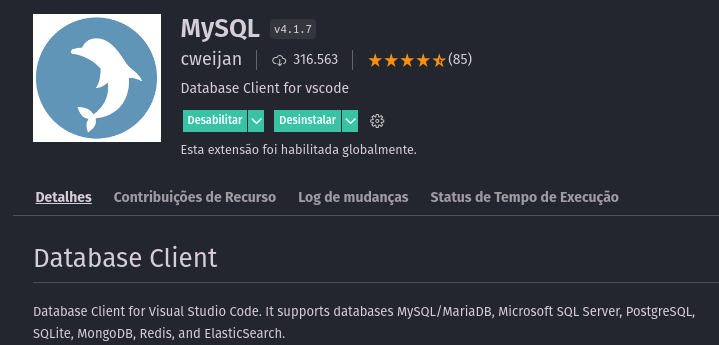
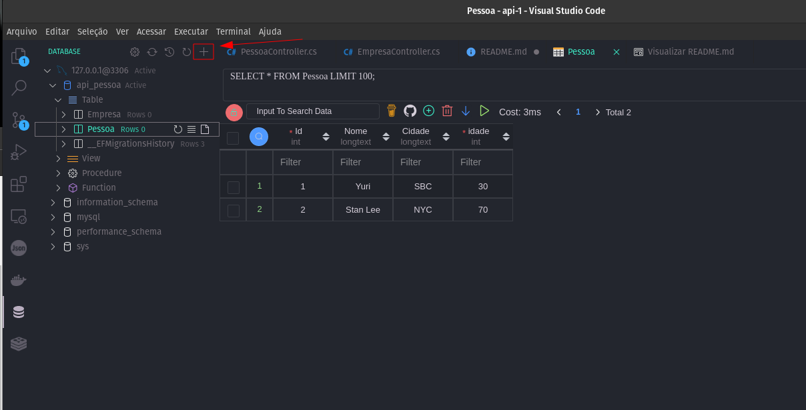
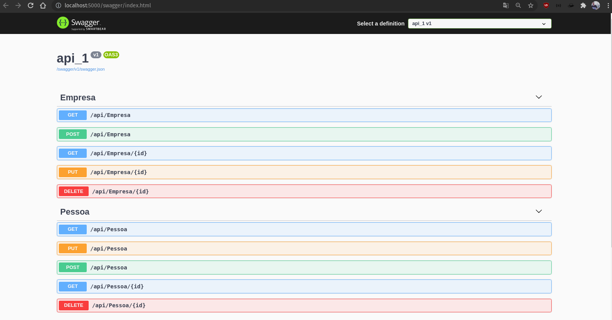

# dotnet-api-swagger

## Como levantar o banco de dados

Caso não tenha a imagem rode:
```
sudo docker pull mysql
```
Após isso, para levantar o container rode:
```
sudo docker run -p 3306:3306 --name mysql1 -e MYSQL_ROOT_PASSWORD=root -d docker.io/library/mysql:latest
```

Confira se o container está em pé:
```
sudo docker container ls -a
```

Você pode acessar o bancos de dados através do VS code utilizando um a extensão MySql, basta ir em extensões e procurar por MySql.



-----------------------------------------------------------------------------------------------------------------------

> Agora você pode mapear o MySql na extensão instalada, basta clicar no sinal de "+" e informar o nome do banco de dados, o usuário e a senha. E você poderá consultar dessa forma:



## Clonando o projeto:
Após clonar o projeto, certifique que você tenha o dotnet instalado na máquina e basta rodar o comando:
```
dotnet run
```
No seu localhost abrira uma nova aba com o swagger.



Fique a vontade para utilizar essa API para o que precisar.

Em caso de dúvidas, pode entrar em contato através do e-mail: yuri.erik.oliveira@gmail.com.

Vlw!!! :D
